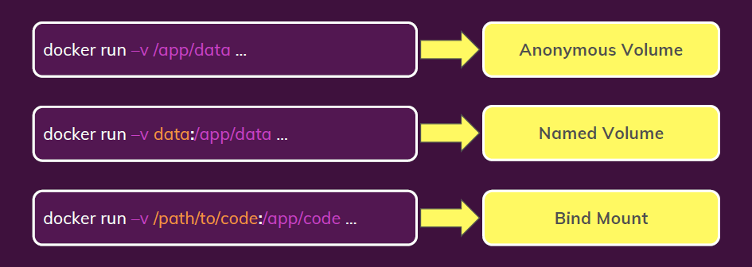

# Intro: Images and Containers

These are my personal notes.

# I. Overview
## A. Concepts
* A `Dockerfile` is analougsly similar a "Makefile", but used to generate a docker `image`
* A docker `image` is like a "class" or the model for a container
* A docker `container` is like an **instance** of an `image`, i.e., you can spin up as many containers as you'd like from the same image
* You can stop and re-start a previously spun up `container`
* If you edit your `Dockerfile`, you may need to re-build your `image`
* a docker Volume can help persist data, help organize data within a container - it's whole full class in Docker

## B. Quick start
* `docker build -t duke_app:test .` : this generates an image from the Dockerfile in the current directory
* `docker run <image>` : this creates a container from the image
* `docker start <container>` : this starts an existing container
* `docker compose up -d` : this turns on all the services of a `docker-compose.yml` file in detached mode


## C. Status
* images: `docker images`
* containers: `docker container ls` or `docker ps -a`
* volumes: `docker volume ls`

## D. Example of building an image

* `docker build -t <name>:<tag> <path_to_Dockerfile>` : flag "-t" for tag
* `docker build -t goals:latest ./node-app` example

## E. Create an image from Dockerfile
* you need a `Dockerfile` to build an image
* then run `docker build .` : which then prints the image hash to your console

# II. Common commands
## A. Dockerfile
* `RUN` is an image build step, the state of the container after a RUN command will be committed to the container image. A Dockerfile can have many RUN steps that layer on top of one another to build the image.
* `CMD` is the command the container executes by default when you launch the built image. A Dockerfile will only use the final CMD defined. The CMD can be overridden when starting a container with docker run $image $other_command.
* `ENTRYPOINT` is also closely related to CMD and can modify the way a container is started from an image.
* TLDR: you do all the `RUN` needed to setup your environment, and your (only) `CMD` launches the process running in your container, example, for nginx, extract from github.com/nginxinc/docker-nginx/blob/… you see the line CMD ["nginx", "-g", "daemon off;"] – 
user2915097
May 26, 2016 at 14:00


## B. Images
* `docker images` : show all images
* `docker image inspect <image>` : show more details about the specific image
* `docker run <image>` : generates a new instance of a container


## C. Containers
* `docker run <image>` : create a new container from image
* `docker run --rm -d <image>` : some useful flags
    * the `rm` flag removes container when done
    * the `d` flag for detached
* `docker start <container>` : starts an existing, previously stopped container
* `docker stop <container>`

## D. Temporal containers from images
* `docker run -d --rm --name goals <image> ` : explicitly name the container `goals`
* `docker run -p 3000:80 -d --rm --name goalsapp goals:latest` example

## E. Tags
* tags are useful for versioning of `images` as you rebuild them
* `docker build -t <name>:<tag> <directory-with-Dockerfile>` : flag:`t` for tag
* `docker build -t goals:latest ./node-app` : example of file

## F. Ports
* You may need to map the container's port to the host for your app
* `docker run -p 3000:80 <image>` : host\_port(3000):docker\_port(80)

## G. DockerHub
* This analogously similar to Github but for your images
* Login: `docker login` : make your account on DockerHub first
* Share: `docker push <image>` : push to repository
* Use: `docker pull <image>` : pull from repository

# III. Interacting with an active container
## A. Attach, Detach
* `docker start -a <container>` : restarts in attached mode
* `docker attach <container>` : attaches to container
* `docker logs <container>` : shows what was printed
* `docker logs -f <id> ` : the "f" flag lets you attach
* attaching is just watching the `stdout` print of the container; use `docker exec -it <container> /bin/bash` to enter container (see below).
* `CTRL-P, CTRL-Q` - detaches from current container (don't use `CTRL-C`)


## B. Docker interactive mode
* `docker run -it <image>` : runs container from image, interactively
  * the `-i` flag means interactive
  * the `-t` flag stands for tty (or terminal), 
  * this creates a container from an image
* `docker start -a -i <container>` : attaches and runs interactively

## C. Enter an unattached docker container
* `docker exec -it <container> /bin/bash` : enters a container
  * the `-i` flag means interactive
  * the `-t` flag stands for tty (or terminal), 
  * executes a command on docker, in this case a `/bin/bash` shell
* [more info link](https://devcoops.com/fix-docker-unable-to-start-container-process-exec-bin-bash/)

## D. Copy files to/from host/container
Sometimes you need to copy files to/from the host/container
* `docker cp <source> <target>`
* `docker cp path/local/. container_name:/docker_path/to/app`


# IV. Remove: Clean-up
* `docker rm <container>` : remove container
* `docker rmi <image>` : remove image
* `docker prune <image/container>` : remove all dangling images (untagged) stopped containers
    * `-a` : remove all locally stored images
    * be careful with this the `-a` flag bc it will delete everything, including running containers

# IV. Volumes
## A. Status
* `docker volume ls`

## B. 3 types of volumes
1. Anonymous volume - ephemeral volume
2. Named volume - persistent, but host path managed by docker
3. Bind mount volume - persistent, host path explicitly defined by you

## C. Some volume flags
* Anonymous volume: `docker run -v /app/data` 
* Named volume: `docker run -v HOST_docker:/docker_app/data` 
* Bind Mount volume: `docker run -v ./HOST/path/to/code:/docker_app/data` 



# V. Docker Compose

See below for an example:

```
version: "3.8"
services:
  mongodb:
    image: 'mongo'
    volumes: 
      - data:/data/db
    # environment: 
    #   MONGO_INITDB_ROOT_USERNAME: max
    #   MONGO_INITDB_ROOT_PASSWORD: secret
      # - MONGO_INITDB_ROOT_USERNAME=max
    env_file: 
      - ./env/mongo.env
  backend:
    build: ./backend
    # build:
    #   context: ./backend
    #   dockerfile: Dockerfile
    #   args:
    #     some-arg: 1
    ports:
      - '80:80'
    volumes: 
      - logs:/app/logs # named volume
      - ./backend:/app # bind volume
      - /app/node_modules # anonymous volume
    env_file: 
      - ./env/backend.env
    depends_on:
      - mongodb
  frontend:
    build: ./frontend
    ports: 
      - '3000:3000'
    volumes: 
      - ./frontend/src:/app/src # bind volume
    stdin_open: true
    tty: true
    depends_on: 
      - backend

volumes: 
  data: # named volume
  logs: # named volume
```

# VI. Installation
* Amazon Linux 2: https://gist.github.com/npearce/6f3c7826c7499587f00957fee62f8ee9
* Amazon Linux Extras: https://aws.amazon.com/premiumsupport/knowledge-center/ec2-install-extras-library-software/
* Windows (Desktop): https://docs.docker.com/desktop/install/windows-install/
* Ubuntu (Engine): https://docs.docker.com/engine/install/ubuntu/

# VII. More useful Docker documentation
* https://docs.docker.com/compose/
* https://docs.docker.com/compose/compose-file/
* https://hub.docker.com/_/python/
* https://github.com/docker/awesome-compose

# VIII. Reference
* Source: https://www.udemy.com/course/docker-kubernetes-the-practical-guide/
* Teacher: Maximilian Schwarzmuller

# IX. Links
* https://stackoverflow.com/questions/37461868/difference-between-run-and-cmd-in-a-dockerfile